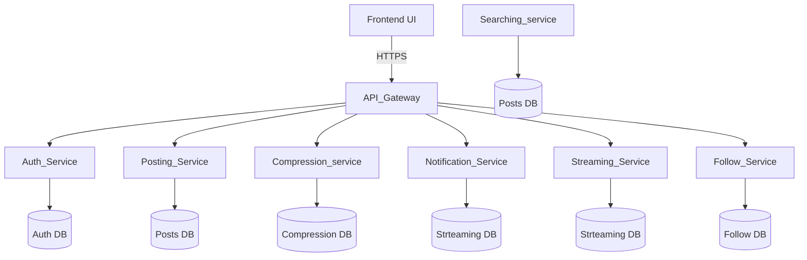

# 🚀 Streaming Platform – Microservices Project

Welcome to the **Streaming Platform** project!  
This organization hosts multiple microservices that together form a scalable, modular system for authentication, posting, and frontend delivery, all orchestrated via Kubernetes.

---

## 🔗 Repositories

- [Auth Service](https://github.com/stream-service/Authentication)  
  Handles user authentication, login, and token management.

- [Posting Service](https://github.com/stream-service/posting)  
  Manages content posting, feeds, and interactions.

- [Notification Service](https://github.com/stream-service/Notification)  
  Manages Notification

- [Frontend](https://github.com/my-org/frontend)  
  Provides the user interface, connecting to backend services via API Gateway.

 

---

## 🏗️ Architecture

 
 ## ⚙️ Tech Stack
    - **Frontend**: HTML,CSS,JS
    - **Backend Services**: Python
    - **Database**: MySQL  
    - **Containerization**: Docker
    - **Orchestration**: Kubernetes (Ingress + LoadBalancer)
    - **CI/CD**: GitHub Actions

 
 

 
 

 

